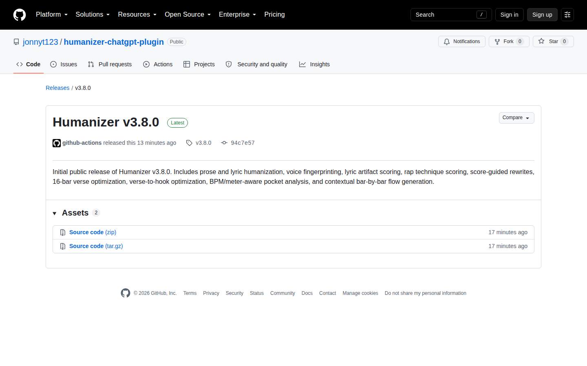
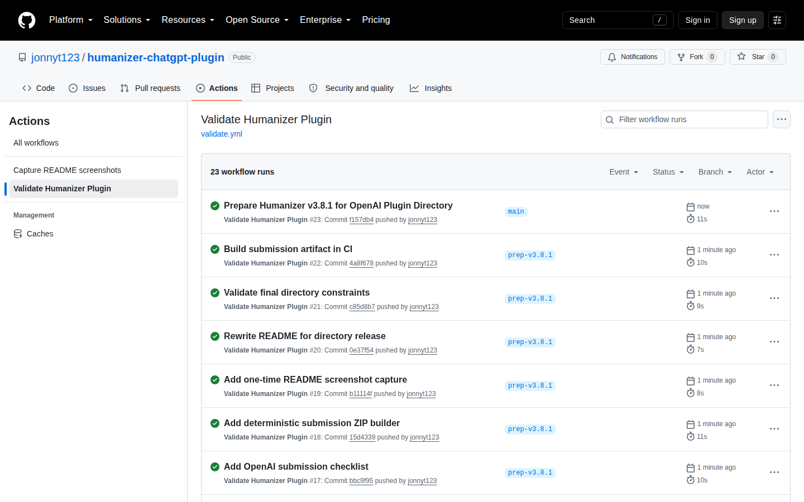

<p align="center">
  
</p>

<h1 align="center">Humanizer</h1>

<p align="center"><strong>Humanize prose and lyrics without flattening the writer's voice.</strong></p>

<p align="center">
  <a href="https://github.com/jonnyt123/humanizer-chatgpt-plugin/actions/workflows/validate.yml"></a>
  <a href="https://github.com/jonnyt123/humanizer-chatgpt-plugin/releases"></a>
  <a href="LICENSE"></a>
  
  
</p>

Humanizer is a skills-only Agent Plugin for ChatGPT and Codex. It rewrites AI-sounding text while preserving supported facts, meaning, concrete detail, and the writer's established voice. Its lyric workflow extends that same principle into rap technique, section structure, rhyme, pocket, cadence, and BPM-aware flow planning.

It has **no MCP server, no third-party login, no external account access, and no publisher-operated data service**.

## What Humanizer does

| Workflow | What it adds | What it protects |
|---|---|---|
| Prose humanization | Removes structural AI-writing tells and generic inflation | Meaning, supported facts, tone |
| Voice fingerprint | Learns recurring rhythm, syntax, diction, punctuation, and detail habits from supplied samples | Explicit user preferences and individual voice |
| Lyric artifact audit | Scores editing risk from 0–5 and identifies specific artifact patterns | Strong original lines and concrete details |
| Rap analysis | Scores multis, pocket, cadence, and rhyme density separately | Meaning over technical density |
| Score-guided rewrite | Generates competing repairs for weak bars and accepts only improvements | Strong bars, setup/payoff, rhyme chains |
| Verse + hook optimizer | Evaluates sections together instead of line by line | Hook ownership, transitions, narrative continuity |
| BPM-aware flow | Uses BPM, meter, stress, breath load, and neighboring bars | Natural pronunciation and realistic timing claims |

## Screenshots

### Public release



### Validation workflow



These are captured from the public GitHub repository so the documentation reflects the actual release and CI state rather than a mockup.

## Examples

### Humanize prose

**Input**

> It's not just about efficiency; it's about unlocking a more robust and vibrant future for teams.

**Humanizer**

> The change is meant to help teams work more efficiently.

The rewrite removes staged contrast, inflated language, and stock AI diction without inventing a stronger claim.

### Audit lyrics before rewriting

```text
Line  Risk  Tags                     Action
1     1/5   —                        Preserve
2     4/5   GENERIC, FORCED_RHYME    Rewrite
3     0/5   —                        Freeze
4     3/5   EXPLAINS                 Repair
```

Humanizer treats artifact risk as an **editing diagnostic**, not an AI-authorship probability.

### Analyze rap technique independently

```text
Multis:        4/5  sustained internal slant families
Pocket:        3/5  solid anchors; one crowded connector phrase
Cadence:       4/5  established motif with deliberate variation
Rhyme density: 3/5  medium, controlled; meaning keeps moving
```

A sparse narrative verse can be strong even with a low density score. Humanizer does not collapse those dimensions into one quality grade.

## Installation

### Public Plugin Directory

After Humanizer is approved and published, open **Plugins** in ChatGPT or Codex, find **Humanizer**, review the listing, and select **Install plugin** when that control is available for your account or workspace. Availability depends on plan, region, workspace policy, role, and product surface.

### Import from GitHub in a managed workspace

Workspace administrators can import this repository as a plugin marketplace:

1. Open **Workspace settings → Plugins**.
2. Select **Add → Import marketplace**.
3. Use `https://github.com/jonnyt123/humanizer-chatgpt-plugin` as the Source.
4. Leave Path empty because `.agents/plugins/marketplace.json` is at the repository root.
5. Leave Branch/tag/commit empty to follow the default branch, or enter `main` explicitly.
6. Authorize GitHub and import the marketplace.
7. Review the imported Humanizer plugin and set its installation policy.

GitHub-backed marketplaces can sync future repository changes after import.

### Build the public submission archive

```bash
python3 scripts/validate-plugin.py
python3 scripts/build-submission.py
```

Output:

```text
dist/humanizer-plugin-v3.8.1.zip
```

The ZIP contains the portable manifest, branding asset, Humanizer skill and references, license/attribution, and policy/support files. It intentionally excludes MCP/app configuration because Humanizer is skills-only.

## Submit to the OpenAI Plugin Directory

Humanizer is prepared for the **Skills only** submission path. The publisher still has to complete account-level steps that cannot be stored in this repository: select a verified individual/business identity, use an OpenAI Platform organization with Apps Management write access, choose availability, review the automated skill scan, and submit the draft for review.

The exact listing copy and review fixtures are already prepared:

- [`submission/LISTING.md`](submission/LISTING.md)
- [`submission/TEST_CASES.md`](submission/TEST_CASES.md)
- [`submission/SUBMISSION_CHECKLIST.md`](submission/SUBMISSION_CHECKLIST.md)

Official OpenAI references:

- [Submitting plugins](https://developers.openai.com/plugins/deploy/submission)
- [Plugin submission errors and limits](https://developers.openai.com/plugins/deploy/submission-errors)
- [Importing plugin marketplaces from GitHub](https://help.openai.com/en/articles/20001504)

## Project structure

```text
plugin.json                         # Portable Agent Plugins manifest
assets/humanizer.svg                # Directory logo + composer icon
skills/humanizer/SKILL.md           # Humanizer skill
skills/humanizer/references/        # Prose, lyric, rap, beat and flow modules
.agents/plugins/marketplace.json     # GitHub workspace marketplace catalog
.claude-plugin/plugin.json           # Claude-compatible import metadata
submission/                          # Listing copy, tests, submission checklist
scripts/validate-plugin.py           # Repository + directory-limit validation
scripts/build-submission.py          # Deterministic skills-only ZIP builder
PRIVACY.md / TERMS.md / SUPPORT.md   # Public listing policies/support
```

## Validation

Run locally:

```bash
python3 scripts/validate-plugin.py
```

Every push and pull request also runs the same validation in GitHub Actions. The workflow checks manifest/version synchronization, public-directory field limits, starter prompts, branding assets, skills-only boundaries, referenced skill files, marketplace metadata, and review-test counts.

## Design principles

Humanizer is intentionally conservative about authorship and authenticity:

- Artifact scores identify writing patterns; they do not prove who or what wrote a passage.
- User-authored concrete details outrank generic style heuristics.
- Voice samples override generic Humanizer preferences when a pattern is clearly intentional.
- Rap technique is multi-dimensional; higher rhyme density is not automatically better writing.
- BPM and meter improve grid analysis, but text alone does not reveal exact performed microtiming.
- Humanizer does not invent autobiographical detail to make lyrics sound more authentic.

## Privacy and security

Humanizer v3.8.1 is skills-only and does not operate a remote service. See [`PRIVACY.md`](PRIVACY.md), [`SECURITY.md`](SECURITY.md), and [`TERMS.md`](TERMS.md).

## License and attribution

Humanizer is distributed under the MIT License. The package preserves the original Humanizer copyright notice for Siqi Chen and documents the extended plugin workflows in [`NOTICE.md`](NOTICE.md).

See [`LICENSE`](LICENSE) for the full license text.
